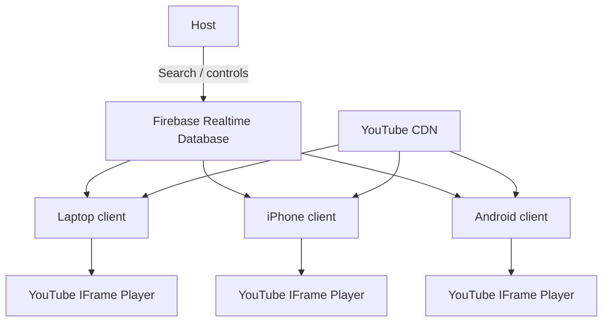

<div align="center">

# VIBIFY

### Press play once. Everyone hears it.

A real-time shared listening room for phones and laptops.  
Create a room, invite friends with a 6-character code, pick a song, and keep every device on the same YouTube playback timeline.

[](https://vibify-mu.vercel.app)
[](https://nextjs.org/)
[](https://www.typescriptlang.org/)
[](https://firebase.google.com/)
[](https://developers.google.com/youtube/iframe_api_reference)
[](LICENSE)

[**Try Vibify**](https://vibify-mu.vercel.app) · [Architecture](docs/ARCHITECTURE.md) · [Roadmap](docs/ROADMAP.md) · [Contributing](CONTRIBUTING.md)

</div>

---

## What is Vibify?

Vibify is a **Spotify-Jam-style shared listening experience for the web**.

A host creates a room and controls playback. Guests join from their own phones or laptops and stream the **same YouTube video directly from YouTube**, while Vibify keeps everyone aligned to one authoritative room timeline.

The important idea is what Vibify **does not** do:

- it does **not** upload songs between devices
- it does **not** rebroadcast the host's audio
- it does **not** send a heavy audio stream through Firebase

Instead, Vibify synchronizes only tiny room-state messages such as:

```text
track
play / pause
position
executeAt
version
```

That keeps the experience fast, bandwidth-light, and much more stable across mobile and desktop browsers.

---

## The experience

```text
HOST                                      GUESTS

Create Room                               Join with code
     │                                         │
     ├────────────── ABC123 ───────────────────┤
     │                                         │
Search a song                                  │
     │                                         │
     └──── same YouTube video ID ─────────────►│
                                               │
Everyone cues the track locally                │
                                               │
Host presses PLAY                              │
     │                                         │
     └──── play at shared timestamp ──────────►│
                                               │
       Laptop      iPhone      Android
          ▶           ▶            ▶

              SAME SONG · SAME MOMENT
```

### Current room controls

- Create / join a room with a 6-character code
- Responsive phone + laptop experience
- Host-only playback authority
- YouTube song search
- Play / pause
- Seek timeline
- ±10 second controls
- Live room presence
- Track-ready state per participant
- Live drift reporting
- Automatic recovery from meaningful playback drift
- Mobile autoplay-unlock handling
- Shareable invite links
- Realtime host/guest state through Firebase

---

## Why the sync architecture works

The first version of this idea tried moving audio files between devices. That made buffering, mobile browser behavior, and media transfer part of the synchronization problem.

Vibify takes the opposite approach:

> **Never move the song through Vibify. Move only the playback state.**

Each client streams from YouTube's own CDN. Firebase is only responsible for shared room state.



### Authoritative playback state

A room stores a compact playback object:

```ts
{
  status: 'playing',
  position: 84.25,
  executeAt: 1788700000000,
  version: 17
}
```

Every client derives the expected position from the same Firebase server clock.

```text
expected position
= command position
+ elapsed time since executeAt
```

Clients report drift periodically. Vibify deliberately **does not constantly seek tiny differences**, because aggressive correction itself can cause broken playback. A hard correction happens only when drift becomes clearly meaningful.

> Vibify targets **no perceptible listening drift**, not mathematically guaranteed `0 ms` physical speaker latency. Browsers, networks, Bluetooth hardware, and YouTube buffering make literal zero latency impossible to guarantee.

For the deeper implementation notes, see [docs/ARCHITECTURE.md](docs/ARCHITECTURE.md).

---

## Tech stack

| Layer | Technology | Purpose |
|---|---|---|
| Frontend | Next.js 15 + React 19 | Responsive web application |
| Language | TypeScript | Typed application + sync logic |
| Realtime | Firebase Realtime Database | Rooms, presence, playback state |
| Auth | Firebase Anonymous Auth | Temporary user identity without signup |
| Music search | YouTube Data API v3 | Find embeddable tracks/videos |
| Playback | YouTube IFrame Player API | Local playback on every device |
| Icons | Lucide React | Interface iconography |
| Deployment | Vercel | Production hosting + API routes |

---

## Project structure

```text
vibify/
├── app/
│   ├── api/youtube/search/   # server-side YouTube search
│   ├── globals.css           # complete responsive visual system
│   └── page.tsx
├── components/
│   ├── VibifyApp.tsx         # rooms, controls, search and UI
│   └── YouTubePlayer.tsx     # YouTube player + sync engine
├── lib/
│   ├── firebase.ts           # Firebase app/auth/database setup
│   ├── room.ts               # room lifecycle + realtime writes
│   └── types.ts
├── docs/
│   ├── ARCHITECTURE.md
│   └── ROADMAP.md
├── firebase.database.rules.json
└── README.md
```

---

## Run locally

### 1. Clone

```bash
git clone https://github.com/Rishikeshsanin/vibify.git
cd vibify
```

### 2. Install

```bash
npm install
```

### 3. Add the YouTube API key

Create `.env.local`:

```bash
YOUTUBE_DATA_API_KEY=your_youtube_data_api_key
```

The dedicated Vibify Firebase web configuration is public by design and already included as safe defaults in `lib/firebase.ts`. Firebase access is protected by Authentication + Realtime Database Security Rules, not by hiding the web config.

### 4. Start

```bash
npm run dev
```

Open `http://localhost:3000`.

---

## Firebase requirements

For a fresh Firebase deployment:

1. Enable **Anonymous Authentication**
2. Create a **Realtime Database**
3. Publish the rules from [`firebase.database.rules.json`](firebase.database.rules.json)
4. Override the `NEXT_PUBLIC_FIREBASE_*` variables only if using a different Firebase project

The production Vibify database is hosted in Singapore (`asia-southeast1`).

---

## YouTube API setup

The server-side search route requires **YouTube Data API v3**.

Recommended key configuration:

- enable only **YouTube Data API v3**
- store the key in Vercel as `YOUTUBE_DATA_API_KEY`
- never commit the key into the repository

Actual playback uses the official **YouTube IFrame Player API** on each client.

---

## Security model

- Guests authenticate anonymously
- Every room has a single authoritative `hostUid`
- Only the host can mutate track/playback state
- Participants can update only their own presence/player state
- Database access requires authenticated Firebase users
- YouTube API credentials stay server-side

See [SECURITY.md](SECURITY.md) for responsible disclosure.

---

## Roadmap

The current release proves the core shared-listening loop. Planned directions include:

- Guest-added queue
- Voting / democratic queue mode
- Host transfer
- QR-code room joining
- Better automatic buffering recovery
- Smarter drift telemetry
- Recently played history
- Room reactions
- Provider abstraction beyond YouTube
- PWA / installable experience
- Native mobile exploration for better background playback

See the full [roadmap](docs/ROADMAP.md).

---

## Browser reality

Vibify is designed for modern mobile and desktop browsers. Mobile browsers may require one user interaction before programmatic audio playback is allowed, so each participant may need to tap **Enable Audio** once after joining a room.

Background/lock-screen behavior is still controlled by the browser and operating system. This project currently optimizes for an active shared listening session in the browser.

---

## Contributing

Ideas, bug reports, experiments around synchronization, and UX improvements are welcome.

Read [CONTRIBUTING.md](CONTRIBUTING.md) before opening a pull request.

---

## License

Released under the [MIT License](LICENSE).

<div align="center">

Built around one simple idea:

### **one room · one song · every device**

[Launch Vibify →](https://vibify-mu.vercel.app)

</div>
