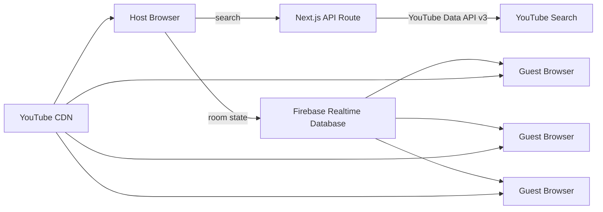

# Vibify Architecture

Vibify is designed around one rule:

> **Synchronize playback state, not audio bytes.**

That decision keeps the system lightweight and avoids turning every listening room into a live audio-streaming problem.

## System overview



Every participant receives the same YouTube `videoId`, then streams that video directly through the official YouTube IFrame Player API.

Firebase carries only shared state such as:

```ts
track
playback
participants
presence
player state
reported drift
```

## Room model

A room is identified by a short code and has one authoritative host.

```ts
interface Room {
  code: string;
  hostUid: string;
  hostName: string;
  createdAt: number;
  track?: Track;
  playback: PlaybackState;
  participants?: Record<string, Participant>;
}
```

## Playback model

```ts
interface PlaybackState {
  status: 'playing' | 'paused';
  position: number;
  executeAt: number;
  version: number;
}
```

`position` is the track position associated with `executeAt`.

When playing:

```text
expectedPosition = position + (serverNow - executeAt)
```

When paused:

```text
expectedPosition = position
```

The `version` counter makes each host command an explicit new state transition.

## Why `executeAt` exists

Broadcasting `PLAY NOW` is inherently unfair: every device receives the network packet at a slightly different time.

Instead, the host schedules a command slightly in the future.

```text
Host clicks play
      │
      ├── room state says execute at T + lead time
      │
Device A receives early ───── waits ─────┐
Device B receives later ─── waits ───────┼── PLAY
Device C receives early ───── waits ─────┘
```

The exact network arrival time matters far less when every client knows the intended execution timestamp.

## Server clock

Firebase exposes `.info/serverTimeOffset`.

Vibify uses it to derive:

```ts
serverNow = Date.now() + serverTimeOffset
```

This gives clients a common time reference without running a separate clock-synchronization server.

## Track lifecycle

1. Host searches YouTube through `/api/youtube/search`
2. Search results are limited to embeddable videos
3. Host selects a result
4. Vibify publishes the selected `Track` into the room
5. Every client cues the same YouTube video
6. Participant `readyFor` state is updated
7. Host sends playback commands

## Drift detection

While a room is playing, each client periodically compares:

```text
actual YouTube player position
            vs
expected room position
```

The difference is reported as `driftMs`.

Vibify deliberately avoids correcting every tiny mismatch. The IFrame player, mobile browsers, buffering, and Bluetooth paths naturally introduce small variance, and repeated forced seeks can sound worse than the drift itself.

Current strategy:

- observe small drift
- surface it in room health
- hard-seek only when drift becomes clearly meaningful
- apply a cooldown before another correction

## Why this is not literal zero latency

No web app can truthfully guarantee `0 ms` physical output difference across arbitrary phones, browsers, Bluetooth devices, codecs, and networks.

Vibify's goal is different:

> **Keep every listener at the same perceived point in the song.**

This is a social-listening synchronization problem rather than sample-accurate multi-speaker audio distribution.

## Mobile autoplay

Browsers commonly block programmatic playback until the user has interacted with the page.

Vibify handles this by presenting an explicit **Enable Audio** action per device. Once the user has interacted with the YouTube player, host playback commands can control the session more reliably.

## Presence

Firebase `onDisconnect` marks participants offline when the realtime connection disappears unexpectedly.

This allows the UI to distinguish current listeners from stale room entries.

## Security boundaries

Firebase Anonymous Auth provides a temporary UID for each participant.

Realtime Database rules enforce:

- authenticated users can read active rooms
- a host creates and controls their room
- guests cannot replace the host
- guests may update only their own participant node
- the host may manage participant state when necessary

The YouTube Data API key is never shipped to the client. Search requests go through a Next.js server route.

## Main implementation files

| File | Responsibility |
|---|---|
| `components/VibifyApp.tsx` | Product UI, room flow, host controls, search |
| `components/YouTubePlayer.tsx` | YouTube player integration, scheduled commands, drift monitoring |
| `lib/room.ts` | Firebase room lifecycle and state writes |
| `lib/firebase.ts` | Firebase initialization and anonymous auth |
| `app/api/youtube/search/route.ts` | Server-side YouTube search |
| `firebase.database.rules.json` | Realtime Database authorization |

## Future architecture directions

Potential extensions are intentionally separated from the current core:

- queue service / guest voting
- provider abstraction (`youtube`, future providers)
- host transfer
- room persistence and listening history
- smarter reconnection recovery
- richer drift telemetry
- PWA / native app support for background playback

The core invariant should remain unchanged:

> **Each device plays locally; the room synchronizes intent.**
